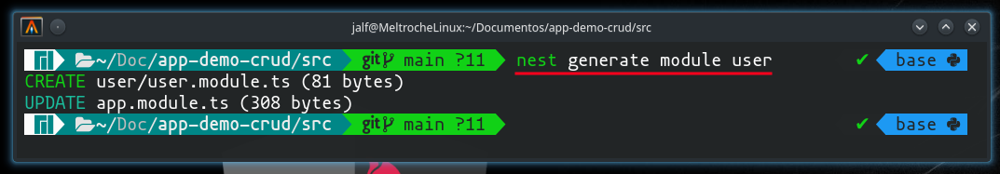
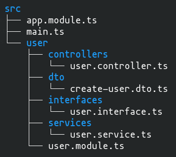

# Qué son los módulos


Fuente: (<https://docs.nestjs.com/modules>)

Los módulos **son clases apoyadas en el decorador `@Module`**, el cual, proporciona metadatos a Nest, los cuales, son utilizados para organizar la estructura de la aplicación.

**Cada aplicación está compuesta por un módulo**, el módulo principal. Dicho módulo es el punto de partida que Nest utiliza para construir los cimientos del aplicativo, es decir, la estructura interna de los datos que Nest usa para resolver las relaciones y dependencias entre módulos y proveedores.

Normalmente las aplicaciones pequeñas suelen tener sólo el módulo principal, pero esto no es un caso común. **Los módulos son una forma eficaz de organizar los componentes del aplicativo desarrollado**. Por lo tanto, para la mayoría de las aplicaciones, la arquitectura resultante emplea múltiples módulos, cada uno encapsulando un conjunto de capacidades estrechamente relacionadas.

Para crear un módulo por medio del CLI de Nest, es necesario abrir la consola y digitar el siguiente comando `nest generate module [NOMBRE DEL MODULO]`, situado en la raíz, no del proyecto, sino, del código fuente del aplicativo.



El decorador `@Module` toma un único objeto, el cual, sus propiedades describen el módulo.

```typescript
import { Module } from '@nestjs/common';

@Module({
    providers: [],
    controllers: [],
    imports: [],
    exports: [],
})
export class AppModule {}
```

**`providers`**, aquí se referencian los proveedores que serán instanciados por el inyector de dependencias de Nest, y que pueden ser compartidos por lo menos en este módulo.

**`controllers`**, se establece el conjunto de controladores que deben ser instanciados para el módulo en cuestión.

**`imports`**, se establece la lista de módulos requeridos a usar en el módulo que se está definiendo.

**`exports`**, es el listado de módulos, controladores y/o proveedores que el actual módulo puede llegar a proveer al módulo que instancia el módulo que se está definiendo, es decir, el módulo actual.

En Nest, **cuando se crea un módulo, este encapsula los proveedores de manera predeterminada**, lo anterior significa que es imposible inyectar un proveedor que no sea parte directamente del módulo actual, ni son exportados desde los módulos importados. Por lo tanto, se puede considerar los proveedores exportados de un módulo como la interfaz pública del módulo o API.

## Características de los módulos

Dando por cierto que, `UserController` y `UserService` pertenecen al mismo dominio de aplicación, tiene sentido moverlos a un módulo llamado `UserModule`. Lo anterior ayuda a gestionar la complejidad de la aplicación y a desarrollarla con los principios SOLID.

`user/user.module.ts`
```typescript
import { Module } from '@nestjs/common';
import { UserController } from './controllers/user.controller';
import { UserService } from './services/user.service';

@Module({
    controllers: [UserController],
    providers: [UserService],
})
export class UserModule {}
```

Dado lo anterior la forma de importar el `UserModule` en el módulo principal, sería la siguiente:

`app.module.ts`
```typescript
import { Module } from '@nestjs/common';
import { UserModule } from './user/user.module';

@Module({
    imports: [UserModule],
})
export class AppModule {}
```

Y así es como se podría ver la estructura de carpetas para con dicho módulo.

