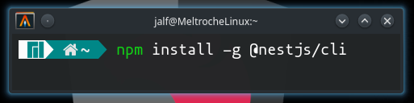

# Instalación de NestJS (CLI)

Para poder trabajar con Nest, es **indispensable instalar NodeJS** ya sea en su última versión estable disponible o versión LTS (<https://nodejs.org/>).

Una vez haya instalado NodeJS, entonces el siguiente paso es abrir una consola y ejecutar el siguiente comando:



Cuando el comando anterior se haya terminado de ejecutar, la velocidad dependerá de su velocidad de Internet, entonces se debe comprobar la versión de Nest que se haya instalado con el comando ```nest --version```.
